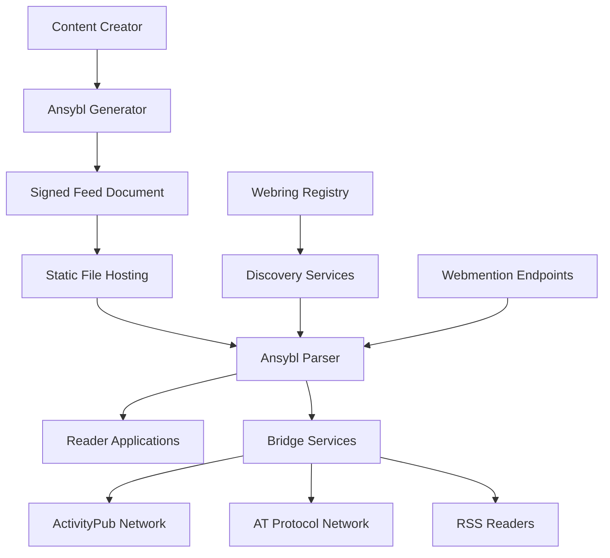

# Design Document

## Overview

The Ansybl Protocol Specification design creates a universal social syndication protocol that bridges the fragmented decentralized social media landscape. The system uses a JSON-based format with cryptographic signatures to enable content creators to publish once and reach audiences across ActivityPub (Mastodon), AT Protocol (Bluesky), RSS readers, and other platforms while maintaining content ownership and authenticity.

The design follows a hybrid approach: simpler than ActivityPub's complex federation model, more social than RSS's one-way syndication, and more interoperable than AT Protocol's content-addressed system. The protocol prioritizes developer experience, self-hosting capabilities, and user privacy while providing optional discovery and social features.

## Architecture

### Core Architecture Principles

1. **Static-First Design**: Feed documents are standard JSON files servable over HTTPS without server-side processing
2. **Cryptographic Integrity**: All content is signed using ed25519 signatures for authenticity verification
3. **Progressive Enhancement**: Basic syndication works without advanced features; social and discovery features are optional
4. **Protocol Agnostic**: Bridges to existing protocols rather than replacing them
5. **Self-Sovereign**: No centralized services required for basic functionality

### System Components



### Protocol Stack

1. **Transport Layer**: HTTPS for feed delivery and security
2. **Format Layer**: JSON with semantic versioning and schema validation
3. **Security Layer**: ed25519 signatures with public key distribution
4. **Social Layer**: Reply threading, interaction tracking, and cross-protocol bridging
5. **Discovery Layer**: Optional webring, Webmention, and search services

## Components and Interfaces

### Feed Document Structure

The core Ansybl document follows a hierarchical JSON structure:

```json
{
  "version": "https://ansybl.org/version/1.0",
  "title": "Creator's Feed Title",
  "home_page_url": "https://creator.example.com",
  "feed_url": "https://creator.example.com/feed.ansybl",
  "description": "Feed description",
  "icon": "https://creator.example.com/icon.png",
  "language": "en-US",
  "author": {
    "name": "Creator Name",
    "url": "https://creator.example.com",
    "avatar": "https://creator.example.com/avatar.jpg",
    "public_key": "ed25519:AAAC4NiQqKqBdgYkCdoO21cjWFPluCcHK2aXgwf9fAG2Ag=="
  },
  "items": [
    {
      "id": "https://creator.example.com/posts/2025-11-04-first-post",
      "uuid": "550e8400-e29b-41d4-a716-446655440000",
      "url": "https://creator.example.com/posts/2025-11-04-first-post",
      "title": "My First Ansybl Post",
      "content_text": "This is my first post using the Ansybl protocol!",
      "content_html": "<p>This is my first post using the <strong>Ansybl protocol</strong>!</p>",
      "summary": "Introduction to Ansybl posting",
      "date_published": "2025-11-04T10:00:00Z",
      "date_modified": "2025-11-04T10:00:00Z",
      "author": {
        "name": "Creator Name",
        "url": "https://creator.example.com"
      },
      "tags": ["ansybl", "decentralization", "social-media"],
      "attachments": [],
      "interactions": {
        "replies_count": 0,
        "likes_count": 0,
        "shares_count": 0
      },
      "signature": "ed25519:signature_hash_here"
    }
  ],
  "signature": "ed25519:feed_signature_hash_here"
}
```

### Parser Interface

Parsers must implement the following core interface:

```typescript
interface AnsyblParser {
  // Validate document structure and signatures
  validate(document: string): ValidationResult;
  
  // Parse valid document into structured data
  parse(document: string): AnsyblFeed;
  
  // Verify cryptographic signatures
  verifySignatures(feed: AnsyblFeed): SignatureResult;
  
  // Extract specific content items
  getItems(feed: AnsyblFeed, filters?: ItemFilters): AnsyblItem[];
}

interface ValidationResult {
  valid: boolean;
  errors: ValidationError[];
  warnings: ValidationWarning[];
}
```

### Generator Interface

Generators create valid Ansybl documents:

```typescript
interface AnsyblGenerator {
  // Create new feed document
  createFeed(metadata: FeedMetadata): AnsyblFeed;
  
  // Add content item to feed
  addItem(feed: AnsyblFeed, item: ContentItem): AnsyblFeed;
  
  // Sign content with private key
  signContent(content: any, privateKey: string): string;
  
  // Serialize to valid JSON
  serialize(feed: AnsyblFeed): string;
}
```

### Bridge Service Interface and API Security

Bridge services translate between protocols while maintaining strict security posture following OWASP API Security Top 10 guidelines:

```typescript
interface BridgeService {
  // Convert Ansybl to target protocol with rate limiting
  convertTo(feed: AnsyblFeed, targetProtocol: Protocol, authContext: AuthContext): Promise<ConversionResult>;
  
  // Convert from source protocol to Ansybl with validation
  convertFrom(content: any, sourceProtocol: Protocol, authContext: AuthContext): Promise<AnsyblFeed>;
  
  // Sync interactions with proper authorization
  syncInteractions(itemId: string, interactions: Interaction[], authContext: AuthContext): Promise<SyncResult>;
}

interface AuthContext {
  user_id: string;
  permissions: Permission[];
  rate_limit_key: string;
  request_signature: string;
}
```

**API Security Requirements:**
1. **Authentication**: All bridge API endpoints MUST require cryptographic authentication using Ansybl signatures
2. **Authorization**: Implement Broken Object-Level Authorization (BOLA) protection - users can only access their own content
3. **Rate Limiting**: Implement per-user and per-IP rate limiting to prevent DoS attacks
4. **Input Validation**: Strict validation of all inputs against JSON Schema and content size limits
5. **Audit Logging**: Log all bridge operations for security monitoring and debugging
6. **HTTPS Only**: All bridge communications MUST use TLS 1.3 or higher
7. **Content Security**: Sanitize all HTML content and validate media URLs before processing
```

## Data Models

### Core Data Types

```typescript
interface AnsyblFeed {
  version: string;
  title: string;
  home_page_url: string;
  feed_url: string;
  description?: string;
  icon?: string;
  language?: string;
  author: Author;
  items: AnsyblItem[];
  signature: string;
}

interface Author {
  name: string;
  url?: string;
  avatar?: string;
  public_key: string;
}

interface AnsyblItem {
  id: string;
  uuid?: string;
  url: string;
  title?: string;
  content_text?: string;
  content_html?: string;
  content_markdown?: string;
  summary?: string;
  date_published: string;
  date_modified?: string;
  author?: Author;
  tags?: string[];
  attachments?: Attachment[];
  in_reply_to?: string;
  interactions?: InteractionCounts;
  signature: string;
}

interface Attachment {
  url: string;
  mime_type: string;
  title?: string;
  size_in_bytes?: number;
  duration_in_seconds?: number;
  width?: number;
  height?: number;
  alt_text?: string;
  blurhash?: string;
  data_uri?: string;
}

interface InteractionCounts {
  replies_count: number;
  likes_count: number;
  shares_count: number;
  replies_url?: string;
  likes_url?: string;
  shares_url?: string;
}
```

### Signature Format and JSON Canonicalization

Content signatures use a strictly defined canonical representation to prevent signature forgery and ensure cross-implementation agreement. The canonicalization process follows RFC 8785 (JSON Canonicalization Scheme) with Ansybl-specific requirements:

**Canonicalization Algorithm:**
1. **Key Ordering**: All object keys MUST be sorted lexicographically by Unicode code point
2. **Whitespace Handling**: Remove all insignificant whitespace (spaces, tabs, newlines outside string values)
3. **String Escaping**: Use minimal JSON escaping (only required characters: `"`, `\`, control characters U+0000 through U+001F)
4. **Number Representation**: Use shortest possible representation without leading zeros or unnecessary decimal points
5. **Boolean/Null**: Use lowercase `true`, `false`, `null`

**Signature Data Structures:**

```typescript
interface SignableContent {
  // For feed-level signatures - canonical representation
  feed_signature_data: {
    author: Author;           // Sorted alphabetically
    feed_url: string;
    home_page_url: string;
    timestamp: string;        // ISO 8601 format
    title: string;
    version: string;
  };
  
  // For item-level signatures - canonical representation  
  item_signature_data: {
    author: Author;           // Sorted alphabetically
    content_html?: string;    // Optional fields included only if present
    content_text?: string;
    date_published: string;   // ISO 8601 format
    id: string;
    url: string;
  };
}
```

**Canonical JSON Example:**
```json
{"author":{"name":"Alice","public_key":"ed25519:ABC123"},"date_published":"2025-11-04T10:00:00Z","id":"https://example.com/post/1","url":"https://example.com/post/1"}
```
```

### Discovery Data Models

```typescript
interface WebringEntry {
  url: string;
  title: string;
  description: string;
  tags: string[];
  last_updated: string;
  health_status: 'active' | 'inactive' | 'error';
}

interface WebmentionEndpoint {
  source_url: string;
  target_url: string;
  mention_type: 'reply' | 'like' | 'repost' | 'mention';
  verified: boolean;
  date_received: string;
}
```

## Error Handling

### Validation Error Categories

1. **Schema Errors**: Document structure doesn't match JSON Schema
2. **Signature Errors**: Cryptographic verification failures
3. **Format Errors**: Invalid URLs, dates, or data types
4. **Compatibility Errors**: Version mismatches or unsupported features
5. **Network Errors**: Feed fetching or discovery service failures

### Error Response Format

```typescript
interface ErrorResponse {
  error: {
    code: string;
    message: string;
    details?: any;
    suggestions?: string[];
  };
  context: {
    document_url?: string;
    line_number?: number;
    field_path?: string;
  };
}
```

### Extension Handling and Forward Compatibility

Following Atom RFC 4287's rigorous approach to foreign markup and unknown elements:

**Extension Rules:**
1. **Namespace Prefixes**: Extensions MUST use underscore prefix (`_custom_extension`) to distinguish from core fields
2. **Unknown Field Handling**: Parsers MUST NOT signal errors when encountering unknown fields
3. **Extension Scope**: Extensions can appear at feed level, item level, or within nested objects
4. **Preservation**: Parsers SHOULD preserve unknown extensions when re-serializing documents
5. **Validation**: Extensions MUST NOT conflict with reserved field names or future protocol versions

**Extension Processing Algorithm:**
```typescript
interface ExtensionHandler {
  // Process known extensions
  processKnownExtension(field: string, value: any): ProcessedExtension | null;
  
  // Preserve unknown extensions for forward compatibility
  preserveUnknownExtension(field: string, value: any): void;
  
  // Validate extension doesn't conflict with core protocol
  validateExtension(field: string, value: any): ValidationResult;
}
```

**Graceful Degradation Strategy:**
1. **Unknown Fields**: Ignore gracefully, preserve in memory for re-serialization
2. **Missing Optional Fields**: Use sensible defaults defined in specification
3. **Signature Failures**: Mark content as unverified but still display with warning
4. **Network Failures**: Cache last known good state with timestamp
5. **Version Mismatches**: Support multiple versions with clear upgrade paths and compatibility matrix
6. **Malformed Extensions**: Log warnings but continue processing core content

## Testing Strategy

### Unit Testing Requirements

1. **Parser Testing**: Validate against comprehensive test suite of valid and invalid documents
2. **Generator Testing**: Ensure generated documents pass validation
3. **Signature Testing**: Verify cryptographic operations with known test vectors
4. **Bridge Testing**: Confirm accurate protocol translations
5. **Schema Testing**: Validate JSON Schema against edge cases

### Integration Testing Requirements

1. **Cross-Implementation Testing**: Multiple parsers agree on same documents
2. **Protocol Bridge Testing**: Round-trip conversions maintain content integrity
3. **Discovery Testing**: Webring and Webmention functionality
4. **Performance Testing**: Large feeds and high-frequency updates
5. **Security Testing**: Signature verification and attack resistance

### Test Data Sets

1. **Minimal Valid Documents**: Simplest possible valid feeds
2. **Comprehensive Examples**: Full-featured feeds with all optional fields
3. **Edge Cases**: Boundary conditions and unusual but valid content
4. **Invalid Documents**: Common mistakes and malformed content
5. **Attack Vectors**: Malicious content designed to break parsers

### Compliance Testing

1. **JSON Schema Validation**: All examples must validate against official schema
2. **Signature Verification**: All signed content must verify correctly
3. **Cross-Platform Testing**: Implementations work on major operating systems
4. **Browser Compatibility**: Web-based tools work in modern browsers
5. **Performance Benchmarks**: Parsing and generation meet performance targets

### Security Testing

1. **Signature Forgery Attempts**: Verify signatures cannot be faked using known attack vectors
2. **Content Injection**: Ensure HTML/JSON content is properly escaped and sanitized
3. **DoS Resistance**: Large documents and malformed content don't crash parsers
4. **Key Rotation**: Verify old signatures remain valid during key transitions
5. **Privacy Leaks**: Ensure no unintended data exposure in feeds or bridge services
6. **API Security**: Test bridge services against OWASP API Security Top 10 vulnerabilities
7. **Canonicalization Attacks**: Verify canonical JSON generation is consistent across implementations

## Cryptographic Security for ActivityPub Bridge

### Leveraging Ansybl Signatures for Fediverse Authentication

The Ansybl-to-ActivityPub bridge can address ActivityPub's ephemeral authentication weaknesses by using Ansybl's inherent cryptographic security:

**Enhanced Authentication Model:**
1. **Persistent Identity**: Ansybl's ed25519 signatures provide cryptographic identity that survives server migrations
2. **Content Integrity**: Bridge can verify Ansybl content authenticity before translating to ActivityPub
3. **Replay Attack Prevention**: Timestamp-based signatures prevent replay attacks across protocols
4. **Key-Based Federation**: Use Ansybl public keys as ActivityPub actor identifiers for stronger identity verification

**Implementation Strategy:**
```typescript
interface ActivityPubBridge {
  // Create ActivityPub actor from Ansybl author with cryptographic verification
  createActor(ansyblAuthor: Author): ActivityPubActor;
  
  // Translate Ansybl content with signature verification
  translateContent(item: AnsyblItem): ActivityPubObject;
  
  // Verify incoming ActivityPub interactions against Ansybl signatures
  verifyInteraction(activity: ActivityPubActivity, ansyblSignature: string): boolean;
}
```

**Security Benefits:**
- **Tamper Detection**: ActivityPub content includes Ansybl signature for verification
- **Identity Portability**: Users can migrate between ActivityPub servers while maintaining cryptographic identity
- **Content Authenticity**: Readers can verify content originated from claimed author
- **Bridge Integrity**: Prevents malicious bridges from forging content

The testing strategy ensures robust, secure, and interoperable implementations while maintaining the protocol's simplicity and developer-friendly nature.