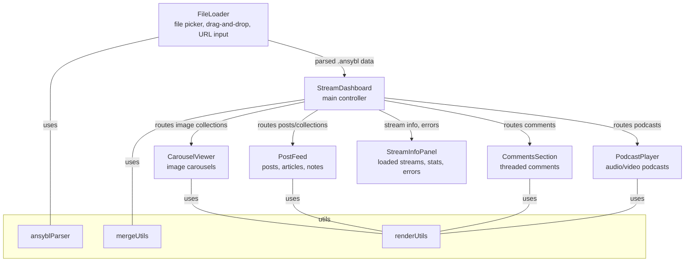

# Technical Plan: Ansybl Streams Webpage

## Project Structure

```
webpage/
  index.html
  styles.css
  app.js
  components/
    FileLoader.js
    StreamDashboard.js
    CarouselViewer.js
    PostFeed.js
    CommentsSection.js
    PodcastPlayer.js
    StreamInfoPanel.js
  utils/
    ansyblParser.js
    mergeUtils.js
    renderUtils.js
```

## Main Components

- **FileLoader**: Handles file picker, drag-and-drop, and URL input for loading .ansybl streams.
- **StreamDashboard**: Main controller, manages loaded streams and routes them to the correct viewer.
- **CarouselViewer**: Displays image collections as carousels.
- **PostFeed**: Displays posts, articles, notes, and mixed collections.
- **CommentsSection**: Renders threaded comments, either attached to posts or standalone.
- **PodcastPlayer**: Specialized for audio/video podcast streams.
- **StreamInfoPanel**: Shows loaded streams, stats, and errors.

## Utilities

- **ansyblParser**: Parses .ansybl and .json files into stream objects.
- **mergeUtils**: Merges multiple streams, deduplicates items, etc.
- **renderUtils**: Shared rendering helpers (e.g., formatting, media rendering).

## Data Flow

- User loads one or more .ansybl files (or URLs) via FileLoader.
- FileLoader parses and passes data to StreamDashboard.
- StreamDashboard determines stream type and routes to the appropriate viewer.
- Each viewer renders its stream type (carousel, feed, comments, podcast).
- StreamInfoPanel displays loaded streams and errors.

## Component/Data Flow Diagram



## Key Features

- Modular, extensible ReactJS architecture
- Supports image carousels, post feeds, comments, and podcasts
- Loads .ansybl files via file picker, drag-and-drop, or URL
- Clear error handling and stream info display
- Easy to add new stream viewers in the future

---

**Please review this plan. Would you like to make any changes or proceed to implementation?**